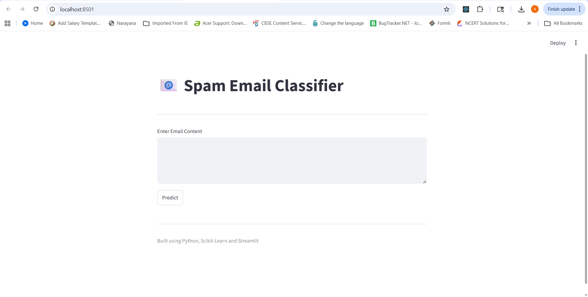
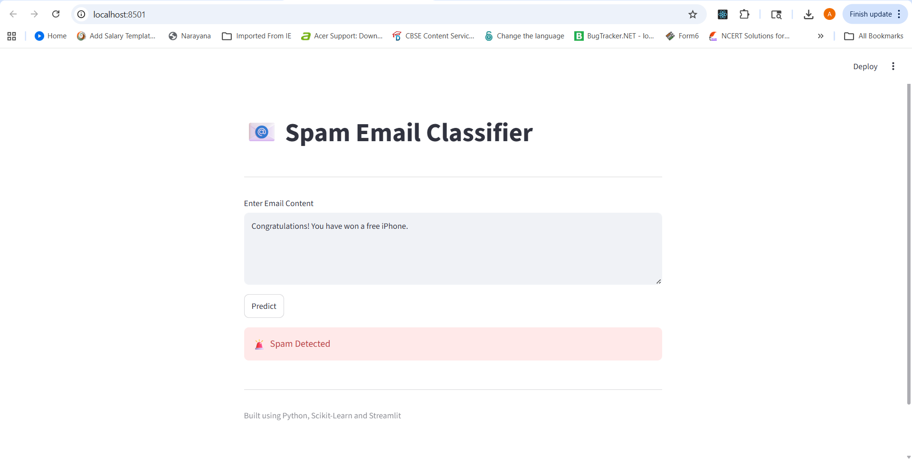
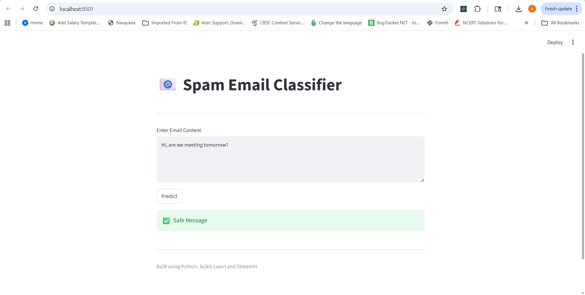
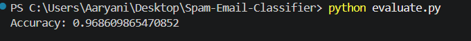
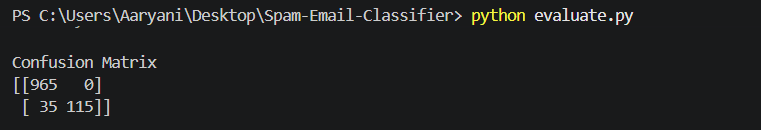
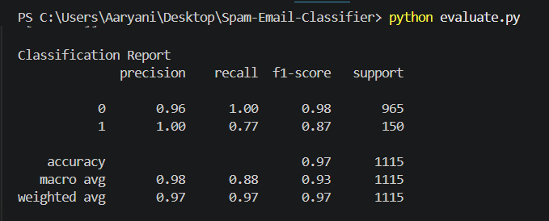

# Spam Email Classifier

## Project Overview

This project uses Machine Learning to classify messages as Spam or Not Spam.

## Technologies Used

- Python
- Pandas
- Scikit-Learn
- Streamlit

## Machine Learning Algorithm

- TF-IDF Vectorization
- Multinomial Naive Bayes

## Dataset

SMS Spam Collection Dataset

## Accuracy

98% Accuracy

## How to Run

Install dependencies:
=======
# 📧 Spam Email Classifier Using Machine Learning

## 📌 Project Overview

The Spam Email Classifier is a Machine Learning project that automatically classifies messages as **Spam** or **Not Spam (Ham)** based on their content.

This project uses **Natural Language Processing (NLP)** techniques to preprocess text data and a **Multinomial Naive Bayes** classifier to predict whether a message is spam.

The project also includes a **Streamlit web application** that allows users to test messages through a simple graphical interface.

---

## 🎯 Objectives

- Detect spam messages automatically.
- Learn text preprocessing techniques.
- Apply Machine Learning for text classification.
- Evaluate model performance using standard metrics.
- Deploy the model using Streamlit.

---

## 📂 Dataset Information

**Dataset Name:** SMS Spam Collection Dataset

**Source:** UCI Machine Learning Repository / Kaggle

**Dataset Description:**

The dataset contains SMS messages labeled as:

- **Ham (0)** → Legitimate message
- **Spam (1)** → Unwanted promotional or fraudulent message

### Sample Data

| Label | Message |
|---------|---------|
| Ham | Hey, are we meeting tomorrow? |
| Spam | Congratulations! You have won a free iPhone. |

---

## 🛠️ Technologies Used

- Python
- Pandas
- NumPy
- Scikit-learn
- Streamlit
- Pickle
- Git & GitHub
- VS Code

---

## 🤖 Machine Learning Algorithm

### Feature Extraction

TF-IDF (Term Frequency – Inverse Document Frequency)

TF-IDF converts text messages into numerical vectors that can be processed by Machine Learning algorithms.

### Classification Algorithm

**Multinomial Naive Bayes**

Reasons for selection:

- Fast training
- High efficiency for text classification
- Excellent performance on spam detection tasks

---

## 🔄 Project Workflow

```text
Dataset
   ↓
Data Cleaning
   ↓
Label Encoding
   ↓
TF-IDF Vectorization
   ↓
Train-Test Split
   ↓
Model Training
   ↓
Model Evaluation
   ↓
Model Saving
   ↓
Streamlit Deployment
```

---

## 📊 Model Performance

### Evaluation Metrics

- Accuracy Score
- Precision
- Recall
- F1-Score
- Confusion Matrix

### Accuracy Achieved

**Accuracy: 96.86%**


---

## 📷 Screenshots

### Home Page



### Spam Prediction



### Not Spam Prediction



### Accuracy Output



### Confusion Matrix



### Classification Report Output



## 📁 Project Structure

```text
Spam-Email-Classifier/
│
├── dataset/
│   └── spam.csv
│
├── models/
│   ├── spam_classifier.pkl
│   └── vectorizer.pkl
│
├── screenshots/
│   ├── homepage.png
│   ├── spam_prediction.png
│   ├── not_spam_prediction.png
│   ├── accuracy_output.png
│   └── confusion_matrix.png
│
├── train_model.py
├── predict.py
├── evaluate.py
├── app.py
├── requirements.txt
├── README.md
└── Project_Report.pdf
```

---

## ⚙️ Installation Steps

### Clone Repository

```bash
git clone https://github.com/yourusername/Spam-Email-Classifier.git
```

### Move into Project Directory

```bash
cd Spam-Email-Classifier
```

### Install Dependencies


```bash
pip install -r requirements.txt
```


Train model:
=======
---

## 🚀 How to Run

### Train the Model


```bash
python train_model.py
```


Run app:
=======
### Evaluate the Model

```bash
python evaluate.py
```

### Run Prediction Script

```bash
python predict.py
```

### Launch Streamlit Application


```bash
streamlit run app.py
```


## Project Structure

```text
dataset/
models/
train_model.py
predict.py
app.py
```
=======
---

## 🧪 Example Prediction

### Input

```text
Congratulations! You have won a free iPhone.
Click here to claim your prize.
```

### Output

```text
Spam
```

### Input

```text
Hi, are we meeting tomorrow at 10 AM?
```

### Output

```text
Not Spam
```

---

## 🌟 Future Enhancements

- Deep Learning-based spam detection
- LSTM and Transformer models
- Multilingual spam classification
- Email attachment analysis
- Cloud deployment using AWS or Azure
- Real-time email filtering integration

---

## 👨‍💻 Author

**Name:** B. Aaryani

**Internship:** Codec Technologies

**Domain:** Artificial Intelligence & Machine Learning

**GitHub:** https://github.com/aaryani2258

---

## 📜 License

This project is developed for educational and internship purposes.

---

### ⭐ If you found this project useful, consider giving it a star on GitHub.
